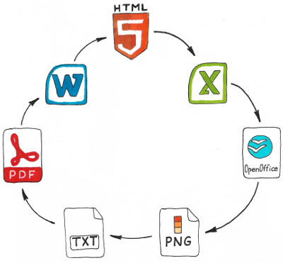

# PHP wrapper over LibreOffice converter
Simple way for documents conversion into various formats.

For example: html -> docx, html -> pdf, docx -> html and many more.



## Usage

```
use Mnvx\Lowrapper\Converter;
use Mnvx\Lowrapper\LowrapperParameters;
use Mnvx\Lowrapper\Format;

// Create converter
$converter = new Converter();

// Describe parameters for converter
$parameters = (new LowrapperParameters())
    // HTML document
    ->setInputFile('test.html')
    // Format of result document is docx
    ->setOutputFormat(Format::TEXT_DOCX)
    // Result file name
    ->setOutputFile('path-to-result-docx.docx');

// Run converter
$converter->convert($parameters);
```

More [examples](/examples)

## Requirements

- PHP 5.5+
- libreoffice-core

## Installation

```
sudo apt-get install libreoffice-core --no-install-recommends
composer require mnvx/lowrapper
```

## License

Released under the MIT license